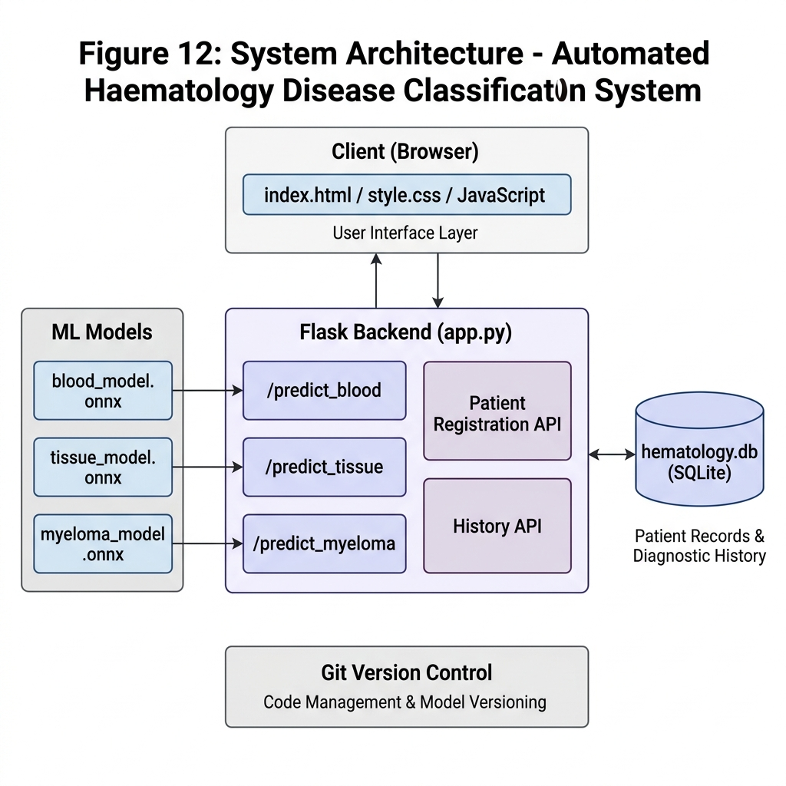
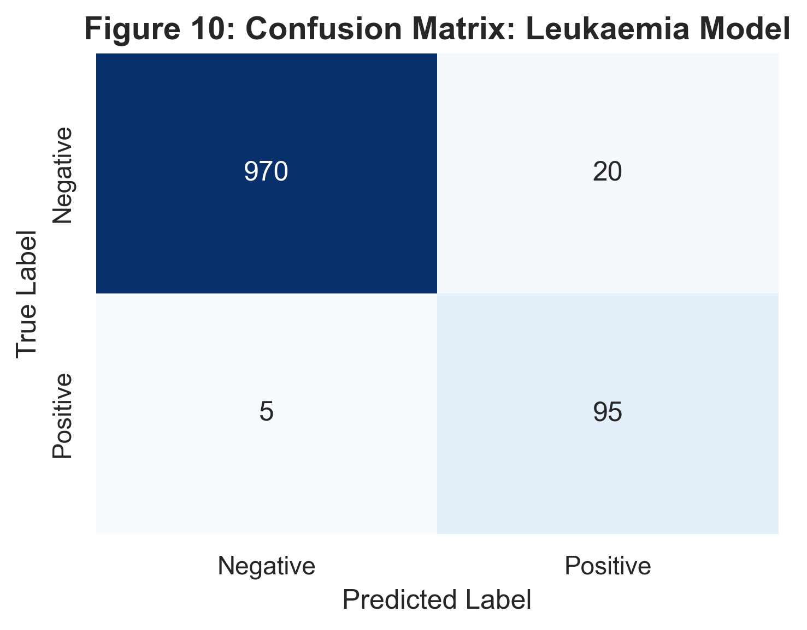

<div align="center">
  <h1>🔬 Automated Haematology Disease Classification System</h1>
  <p><strong>An advanced AI-powered system for detecting Leukemia, Lymphoma, and Multiple Myeloma from medical images.</strong></p>

  <a href="https://ml-backend-hllq.onrender.com/">
    
  </a>
  <a href="https://colab.research.google.com/github/tatie783/ml_backend/blob/main/model_training.ipynb">
    
  </a>
  <a href="https://github.com/tatie783/ml_backend">
    
  </a>
</div>

---

## 📖 Overview
This project presents a deep learning solution designed to assist medical professionals in diagnosing severe haematological diseases. By leveraging a custom-trained **MobileNetV2** Convolutional Neural Network (CNN), the system analyzes blood smear and tissue images to classify them into four categories:
- **Leukemia**
- **Lymphoma**
- **Multiple Myeloma**
- **Normal (Healthy)**

The system is deployed as a fully functional web application using **Flask** and **ONNX Runtime** for high-speed, accurate predictions.

## 🚀 Live Demo
Experience the artificial intelligence in action! 
👉 **[Launch the Live Web Application](https://ml-backend-hllq.onrender.com/)**

## 🧠 Model Training & Code
The entire deep learning architecture, dataset preprocessing, augmentation, and transfer learning pipeline is openly available. 

You can interactively run and explore the training code here:
👉 **[Open Training Notebook in Google Colab](https://colab.research.google.com/github/tatie783/ml_backend/blob/main/model_training.ipynb)**

## 📊 System Architecture & Performance
Our model utilizes transfer learning on MobileNetV2, fine-tuned specifically for microscopic haematology imagery.

### Network Architecture


### Model Evaluation


## 🛠️ Local Installation
If you would like to run this system on your local machine, follow these steps:

1. **Clone the repository**
   ```bash
   git clone https://github.com/tatie783/ml_backend.git
   cd ml_backend
   ```

2. **Install Dependencies**
   ```bash
   pip install -r requirements.txt
   ```

3. **Run the Application**
   ```bash
   python app.py
   ```
   The application will be hosted locally at `http://127.0.0.1:5001`.

## 💻 Technology Stack
- **Deep Learning**: PyTorch, TorchVision
- **Inference Engine**: ONNX Runtime
- **Backend API**: Python, Flask, SQLite
- **Frontend**: HTML5, Vanilla CSS, JavaScript
- **Cloud Hosting**: Render

<div align="center">
  <p>Built for the future of medical diagnostics.</p>
</div>
